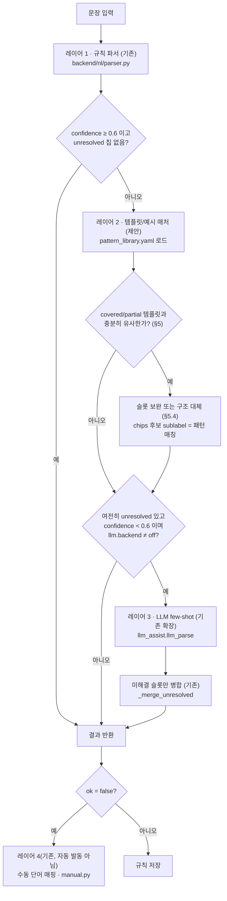

# HYBRID-PARSER — 규칙 · 템플릿 · LLM 3단 폴백 파서 설계 (제안)

> **문서 상태: 설계 제안(Design Proposal). 앱 코드는 이 문서 작성 과정에서 전혀 수정하지 않았다.**
> 아래 내용은 `docs/SPEC-CORPUS.md` §4·§8이 요구한 하이브리드 파서 설계를 구체화한 것이며,
> `tools/corpus/`가 생성한 예시 라이브러리(`pattern_library.yaml`/`gap_library.yaml`)를 데이터
> 자산으로 삼는다. 실제 채택 여부·구현 순서·수치(임계값 등)는 이 문서가 아니라 **사용자가
> `tools/corpus/out/report.md`의 커버리지 결과를 보고 결정**한다. §11의 "변경점 목록"은 전부
> 제안이며 코드는 포함하지 않는다.

## 0. 요약

현재 파서는 **규칙(rule) → LLM** 2단 구조다(`backend/api_v2.py`의 `handle_parse`). 이 문서는 그
사이에 **템플릿/예시 매처**를 끼워 넣어 **규칙 → 템플릿 → LLM**의 3단 폴백으로 확장할 것을
제안한다. 순서의 근거는 Snips NLU의 결정적→확률적 파서 순차 구조와 Rasa의 신뢰도 임계값
폴백이며, HA Assist의 "로컬 우선"이 2025.3에서 조용히 깨졌던 회귀(#139415)를 반면교사로 삼아
**폴백 배선 자체를 회귀 테스트로 고정**할 것을 함께 제안한다(§10).

---

## 1. 배경과 목적

`tools/corpus` 도구가 시드 문법(`templates.yaml`)과 슬롯 사전(`slots.yaml`)으로 코퍼스를 생성해
현재 규칙 파서(`backend/nl/parser.py`)를 구동한 결과, 이번 스냅샷(2026-07-17) 기준 전체 정확률은
**52.2%**(exact 479 · partial 269 · fail 169 / 총 917문장)였다(`tools/corpus/out/report.md`).
나머지 절반 가까이는 규칙이 놓치는 표현 변이 — 어미, 조사, 절 순서, 생략 — 때문이다. 이 문서는
그 갭을 메우는 **세 번째 층(템플릿 매처)**을 규칙과 LLM 사이에 두어:

1. 규칙이 못 잡는 표현이라도 **이미 예시 라이브러리에 등록된 패턴과 충분히 비슷하면** LLM 호출
   (네트워크/과금/지연/비결정성)을 건너뛰고 답을 낸다.
2. 그래도 못 채우면 기존 LLM 보조로 넘어간다 — **기존 동작은 그대로 유지**된다.
3. 예시 라이브러리(`pattern_library.yaml`)를 **회귀 코퍼스·런타임 매처·LLM few-shot** 세 용도로
   재사용해, 하나의 자산이 세 계층을 동시에 뒷받침하게 한다(§8).

## 2. 현재 파이프라인 (as-is, 코드 확인 완료)

### 2.1 레이어 1 — 규칙 파서 (`backend/nl/parser.py`)

`parse(sentence, gazetteer, settings, pins={})` → `{ok, model, chips, summary, area_id, category,
unmatched, confidence, warnings, subrules_count}`. 의존성 0, 형태소 분석기 없이 사전 최장일치 +
'면' 경계 절 분리로 동작한다(`parser.py` 자체 주석 기준 SPEC-V2 §6.2 — 이 문서의 §6과는 다른
번호 체계). 칩(`chip`)마다 후보 목록과 `status`(`confirmed` / `uncertain`
/ `unresolved`)를 갖고, `confidence`는 다음 식으로 계산된다(`_Parser._emit`/`_emit_multi` 동일
공식, `api_v2._recompute`도 같은 식을 재구현):

```
base = mean(각 칩의 최상위 후보 score)      # 후보 없는 칩은 집계 제외
if 어느 칩이든 status == "unresolved": base *= 0.4
base *= 0.9 ** (status == "uncertain" 칩 개수)
confidence = round(min(base, 1.0), 3)
```

`unmatched`는 칩조차 만들지 못한 원문 조각(대상/절)의 리스트다 — 완전히 이해하지 못한 부분이
있었다는 신호로, 지금은 사용자에게 경고만 하고 별도 자동 처리는 없다.

### 2.2 레이어 2(현재) — LLM 보조 병합 (`backend/api_v2.py::handle_parse`)

```python
result = nl_parse(sentence, gz, settings, pins)                      # 레이어 1
needs_help = result["confidence"] < _LLM_TRIGGER_CONF or _has_unresolved(result)   # 0.6 게이트
if needs_help and backend != "off":
    used_llm = await _try_llm_merge(sentence, result, gz, settings, backend)
```

`_LLM_TRIGGER_CONF = 0.6`, `_has_unresolved`는 `status=="unresolved"` 칩 존재 여부다. LLM은
`backend/nl/llm_assist.py::llm_parse`(off/api/cli 디스패치)를 호출하고, 성공하면
`_merge_unresolved`가 **`status=="unresolved"`인 칩만** LLM 결과의 같은 `slot_key`로 채운다 —
이미 규칙이 확정한(`confirmed`) 슬롯은 절대 덮어쓰지 않는다. 채워진 칩은
`status="uncertain"`, `candidates=[{..., sublabel:"AI 추정", score:_LLM_MERGE_SCORE(=0.7)}]`가
되고, `_recompute`가 §2.1과 동일한 식으로 `confidence`/`ok`를 다시 계산한다.

이 구조는 이미 "규칙 우선, 실패 시에만 LLM"이라는 로컬 우선 원칙을 지키고 있다 — 이 문서가
제안하는 것은 이 **둘 사이에 한 단을 끼워 넣는 것**이지, 이 원칙을 새로 만드는 것이 아니다.

### 2.3 레이어 3(현재) — 수동 단어 매핑 (`backend/nl/manual.py`, 그물망)

규칙과 LLM이 모두 실패해도 `tokenize`/`suggest_roles`/`build_model_from_tokens`로 사용자가
토큰마다 역할을 직접 지정해 `RuleModel`을 만들 수 있다(프론트 `manual-map.js`, `parse-card.js`가
import). **자동으로 발동하지 않고 사용자가 "직접 지정"을 열 때만** 쓰이므로 이 문서의 폴백
순서에는 포함하지 않되, "전부 실패해도 사람이 끝까지 구제할 길이 있다"는 최종 그물망으로
§4(다이어그램)·§7(표)에 함께 적어 둔다.

### 2.4 프론트 확인 (수정 없음, 읽기 전용 확인)

`frontend/js/components/parse-card.js`는 `candidate.sublabel`을 이미 범용으로 렌더링한다
(칩 후보 드롭다운, `c.sublabel ? el('span',{class:'cand-sub'}, c.sublabel) : null`). 즉 새 칩
후보가 `sublabel:"패턴 매칭"`을 달고 나와도 **프론트 변경 없이** 그대로 보인다. 또한
`pinsState[slot_key]` → `reparse()` 흐름이 `parser._chip()`의 핀 우선 로직과 맞물려 있어, 사용자가
패턴 매처가 채운 슬롯을 다른 후보로 바꾸면 재해석 시 그 핀이 무조건 우선한다 — 새 레이어가
기존 확정 UX를 깨지 않는다. `used_llm`/`llm_backend` 필드는 캡션으로 표시되는데(`LLM_BACKEND_LABEL`),
동등한 `used_pattern` 캡션을 추가하려면 이 부분만 소폭 확장하면 된다(§11.5, 선택 사항).

---

## 3. 이론적 근거

| 선례 | 구조 | 이 설계에 대응 |
|---|---|---|
| **Snips NLU** `DeterministicIntentParser` → `ProbabilisticIntentParser` | 결정적 파서를 먼저 시도해 **첫 긍정 매칭을 채택**. 결정적 파서는 학습 예시에 대해 **F1 1.0**을 보장(정의상 원문 그대로 매칭). | "규칙 우선" 원칙 자체의 근거. 레이어 2(템플릿)도 **예시에 정의된 패턴에는 결정적으로 F1 1.0**에 가깝게 동작해야 한다는 설계 목표를 준다. |
| **Rasa** `FallbackClassifier` | `confidence_threshold` 미만이거나 1·2위 후보 간 `ambiguity_threshold` 이내면 폴백 인텐트로 전환. | 우리의 `_LLM_TRIGGER_CONF = 0.6` 게이트와 동형. 레이어 2 도입 시 "애매함(ambiguity)" 개념 —즉 템플릿 매칭 유사도 1위·2위가 근접하면 그 매칭을 신뢰하지 않고 다음 레이어로— 을 §5.5에서 함께 제안한다. |
| **HA Assist "로컬 우선"**(2024-06 도입) | 로컬 인텐트로 처리 가능하면 클라우드/LLM 에이전트를 건너뛴다는 사용자 옵션(`prefer_local`). | 우리 시스템의 기존 철학과 동일한 목표. 다만 아래 경고가 이 원칙이 **구현에서 얼마나 쉽게 깨지는지** 보여준다. |
| **HA 2025.3 회귀 [`#139415`](https://github.com/home-assistant/core/issues/139415)** ("Default Conversation Agent Fallback does not work anymore") | "로컬 우선 처리"를 켜 놓아도 2025.3 베타부터 **모든 명령이 로컬을 건너뛰고 곧장 LLM 에이전트로** 전송되는 회귀가 있었다(WebSearch로 실제 이슈를 확인 — 제목·증상 일치). 원인은 폴백 배선의 조건 분기가 리팩터링 중 깨진 것. | **경고**: "레이어 순서를 지킨다"는 설계 의도는 코드로 명시적으로 테스트해 두지 않으면 다음 리팩터링에서 조용히 무너질 수 있다. §10에서 이 교훈을 폴백 배선 회귀 테스트로 구체화한다. |

## 4. 제안 아키텍처 개요



레이어 1·3·4는 **기존 코드 그대로**다. 이 문서가 새로 제안하는 것은 레이어 2 하나이며, 삽입
지점은 `handle_parse`의 `needs_help` 판정 직후 — LLM 호출 **직전**이다(§11.2).

## 5. 레이어 2 상세 설계 — 템플릿/예시 매처 (제안)

목표: `pattern_library.yaml`의 `status: covered`/`partial` 템플릿을 이용해, hassil식 표면
템플릿과 입력 문장을 대조하고 **gold 골격에 슬롯을 바인딩**해 후보를 만든다(SPEC §8). 아래는
구체적인 알고리즘 제안이다 — SPEC은 "delexicalize → 대조 → 슬롯 바인딩"이라는 단계만 못박고
세부 알고리즘은 열어 두었으므로, 이 절의 내용은 전부 **제안**이다.

### 5.1 델렉시컬라이즈 — `Gazetteer.match()` 재사용

새 파서를 만들지 않고 **이미 있는** `gazetteer.py::Gazetteer.match(text)`(§6.1)를 그대로 쓴다.
이 함수는 이미 문장을 스팬 목록으로 분해한다(`type` ∈ `entity/area/person/mode/device_word/
segment/percent/temperature/clock/duration`, 최장일치, 겹침 방지). 델렉시컬라이즈는 이 스팬을
좌→우 순서대로 태그 시퀀스로 바꾸는 얇은 레이어만 추가하면 된다:

```python
# 제안 의사코드 — backend/nl/pattern_match.py (신규, 미구현)
def delexicalize(text: str, gz: Gazetteer) -> list[str]:
    spans = gz.match(text)                       # 기존 §6.1 재사용, 신규 로직 없음
    tags = [_tag_of(sp) for sp in spans]
    return _coalesce_area_device(tags, spans)     # 5.1.1 참조
```

`_tag_of`는 `device_word`일 때 `concept["domain"]`을 붙여 `DEVICE:light` / `DEVICE:fan` /
`DEVICE:climate` / `DEVICE:motion`처럼 세분화한다(그 외 타입은 `AREA`/`MODE`/`SEGMENT`/`PERCENT`/
`DURATION`/`PERSON`/`CLOCK`로 1:1 대응). `scope`(모든/다른)는 `gazetteer.match`가 잡아주는 스팬이
아니라 `parser.py`가 이미 하듯("모든"·"다른" 리터럴 부분일치) 별도 키워드 탐지가 필요하다 —
새 로직이 아니라 **`_split_targets`/`_context_area_for_group`의 판정과 동일한 규칙을 재사용**할
것을 제안한다.

#### 5.1.1 인접 AREA+DEVICE 합치기 (중요한 보정)

`slots.yaml`의 필러는 "거실 조명"처럼 **방+기기가 붙은 구(句)**다. `gazetteer.match`는 이를
독립된 두 스팬(`area:"거실"`, `device_word:"조명"`)으로 나누는데, `templates.yaml`의
`{device_light}`는 슬롯 하나다. 그대로 두면 템플릿 쪽 시퀀스 길이(1)와 입력 쪽 시퀀스 길이(2)가
어긋난다. 따라서 델렉시컬라이즈 마지막 단계에서 **인접(공백만 사이에 있는) `AREA` 다음에 오는
`DEVICE:*`/`PERSON` 스팬을 하나의 슬롯 위치로 합친다** — 이는 `parser.py`가 `_find_area`와
`_find_concept`를 늘 짝지어 `resolve_concept(concept, area_id, text)`로 넘기는 것과 같은 전제를
델렉시컬라이저에도 반영하는 것뿐이다.

### 5.2 템플릿 대조

`pattern_library.yaml`의 각 `covered`/`partial` 항목은 로드 시 한 번, `template:` 필드의
`{slot}` 토큰을 순서대로 뽑아(조사 토큰 `{가}/{을}/{은}/{와}/{로}`와 hassil `<...>`/`[...]`/`(a|b)`
표기는 건너뛰고) **슬롯 이름 시퀀스**를 만들고, 고정된 `SLOT_TO_TAG` 표(부록 A)로 태그
시퀀스로 정규화해 캐시해 둔다(요청마다 다시 파싱하지 않음).

대조는 2단계 제안:

1. **완전일치(빠른 경로)** — 입력 태그 시퀀스가 어느 템플릿의 태그 시퀀스와 정확히 같으면
   그 템플릿을 즉시 채택. 문법 생성 코퍼스와 형태가 같은("낙관적", SPEC §7.7) 입력 대부분은
   여기서 끝난다.
2. **순서보존 유사도(폴백 경로)** — 완전일치가 없으면 `difflib.SequenceMatcher`류의 순서를
   존중하는 비율(예: LCS 기반)로 모든 covered/partial 템플릿과 비교해 최고점 템플릿을 고른다.
   임계값 제안 `_TEMPLATE_SIM_THRESHOLD = 0.72`(튜닝 필요 — §5.5) 미만이면 "매칭 없음"으로
   레이어 3으로 넘긴다.

> 여기서 어절/문자 n-gram **Jaccard**가 아니라 **순서보존** 유사도를 제안하는 이유: 트리거·조건·
> 액션의 등장 순서 자체가 RuleModel 구조를 결정하기 때문이다(§7의 레이어 3과 다른 선택 — 그쪽은
> "어떤 예시가 비슷한 상황인가"를 고르는 것이라 순서보다 어휘 중첩이 더 중요하다).

### 5.3 슬롯 바인딩

최고점 템플릿이 정해지면, 입력의 매칭 스팬을 (합치기 이후) 템플릿의 슬롯 이름 시퀀스와
**위치(ordinal) 기준**으로 짝짓는다 — n번째 `DEVICE:light` 스팬을 템플릿의 n번째
`device_light` 슬롯에 매핑하는 식. 그다음 템플릿의 `gold:` 블록을 그대로 인스턴스화한다
(`{slot.value}` → 매칭된 수치/이름, `{slot.entity}` → 매칭된 entity_id, `{slot.dur}` →
`to_duration_obj`로 만든 duration 객체, `{scope.expand}` → 기존
`gazetteer.entities_by_concept(...)` 결과) — 전부 `gazetteer.py`/`normalize.py`에 **이미 있는**
함수 재사용이고 새 파싱 로직이 없다.

### 5.4 두 가지 개입 모드 — 슬롯 보완 vs 구조 대체

레이어 3(`_merge_unresolved`)은 항상 "이미 확정된 슬롯은 손대지 않고 unresolved만 채운다"는
보수적 병합이다. 레이어 2도 **같은 규율을 기본으로 제안**하되, 규칙 파서가 아예 구조를 못 만든
경우(트리거/액션이 0개라 `_light_validate`가 에러를 낸 경우)에는 슬롯 몇 개를 채워봐야 소용이
없으므로 두 모드로 나눌 것을 제안한다.

| 모드 | 발동 조건 | 동작 |
|---|---|---|
| **슬롯 보완** (기본) | 규칙 파서가 트리거/액션 구조는 만들었고 일부 칩만 `unresolved` | 기존 `_merge_unresolved`와 동일한 함수를 **소스만 다르게**(`source="pattern"`) 재사용해 unresolved 슬롯만 채운다. `confirmed` 슬롯은 절대 덮지 않는다. |
| **구조 대체** | `_light_validate`류 구조 오류 존재(트리거 또는 액션이 0개) | §5.3에서 만든 후보 모델 전체를 채택하고, 규칙 파서가 만든(불완전한) 모델은 버린다. 다중 서브룰(SPEC-V3 §2.1 다중 규칙쌍)의 경우 템플릿의 `subrules` 개수·`slot_key` 접두(`subrules[i].`) 규약을 그대로 따른다. |

두 모드 모두 새 칩 후보에는 `sublabel:"패턴 매칭"`, `reason:f"'{template_id}' 예시와 유사"`,
제안 스코어 `_PATTERN_MERGE_SCORE = 0.75`를 붙인다(레이어 3의 `_LLM_MERGE_SCORE=0.7`보다 높게
잡은 이유: LLM의 자유생성 추정과 달리 예시 라이브러리의 값은 실제로 검증된 gold 골격에서
나오기 때문 — 단 규칙 엔진의 사전확인 일치(0.8~1.0)보다는 낮게 유지해, 규칙이 확정한 값이 항상
더 신뢰받도록 한다). 두 값 모두 최종 조정은 §9의 튜닝 대상이다.

### 5.5 알려진 한계 (단정하지 않음)

- **위치 정렬의 취약성**: 같은 타입 슬롯이 여러 번 나오는데 입력의 등장 순서가 템플릿과
  다르면(예: 문장을 재배열한 패러프레이즈) 오바인딩 가능. 완전일치 우선 + 임계값으로 위험을
  줄이지만 없애지는 못한다. 실제 위험도는 **패러프레이즈 소스 정확률**로만 검증 가능하다
  (§7.7, 이 도구가 이미 분리 측정하도록 설계되어 있음).
- **다중 서브룰 경계**: `parser.py`는 이미 `_find_pivots`로 문장을 서브룰 단위로 나눈다.
  레이어 2를 전체 문장 단위로만 대조하면 이 분해와 어긋날 수 있으므로, 다중 서브룰 입력에는
  **같은 pivot 분해를 재사용해 서브룰별로 대조**할 것을 제안한다(신규 세그멘테이션을 만들지
  않음).
- **애매성(ambiguity) 미처리**: 현재 제안은 1위 템플릿만 본다. Rasa의 `ambiguity_threshold`처럼
  1위·2위 유사도가 근접하면 매칭을 포기하고 레이어 3으로 넘기는 것이 더 안전할 수 있다 — 초기
  구현에서는 단순 임계값으로 시작하고, 오탐이 실제로 report.md에서 관측되면 추가할 것을
  제안한다(과설계 방지).
- **`status: gap` 템플릿은 매칭 풀에서 제외**: gap은 규칙 파서도 대부분 실패한 패턴이라 gold를
  신뢰하되, 애초에 시드 예시 개수가 적어 매칭 신뢰도를 담보하기 어렵다고 보수적으로 판단했다.
  이 판단 자체도 재검토 대상이다.

## 6. 레이어 3 상세 설계 — LLM few-shot 선택기 (기존 확장 제안)

SPEC §8은 "의존성 0 유지를 위해 dense embedding 대신 어절/문자 n-gram Jaccard kNN"을 명시했다.
현재 `llm_assist.py::_user_prompt(inventory_digest, sentence)`는 few-shot 없이 인벤토리 다이제스트
+ 문장만 준다. 제안:

### 6.1 후보 풀과 유사도

후보 풀은 `pattern_library.yaml`의 `examples:`(템플릿당 최대 3문장, 현재 스냅샷 총 32템플릿 ×
~3 ≈ 최대 96문장 — 런타임에 스캔해도 무비용) 전체다. `gap_library.yaml`(83KB, 220클러스터)은
**런타임 자산이 아니라 오프라인 저작 도구**이므로 few-shot 풀에서 제외할 것을 제안한다 — 사람이
갭을 보고 `templates.yaml`에 새 시드를 추가하는 입력일 뿐, 검증된 gold가 없다.

유사도: 입력 문장과 각 예시 문장에 대해 **어절 bigram 집합**과 **문자 3-gram 집합**을 각각 만들고
Jaccard를 구해 가중합(예: 어절 0.6 + 문자 0.4 — 어절은 표현 패턴, 문자는 형태 변이에 강함) 후
내림차순 정렬. 동점 시 `(template_id, example_index)` 사전순으로 타이브레이크해 **완전히
결정적**으로 만든다(무작위/시간 시드 없음 — SPEC §9 원칙을 런타임 코드에도 연장 적용).

```python
# 제안 의사코드 — backend/nl/llm_assist.py 확장(미구현)
def select_few_shot(sentence: str, pattern_library: list[dict], k_min=3, k_max=5) -> list[dict]:
    scored = [(jaccard_score(sentence, ex), tpl["id"], i, ex)
              for tpl in pattern_library for i, ex in enumerate(tpl.get("examples", []))]
    scored.sort(key=lambda t: (-t[0], t[1], t[2]))          # 결정적 타이브레이크
    picked, seen_tpl = [], set()
    for score, tpl_id, i, ex in scored:
        if tpl_id in seen_tpl and len(picked) >= k_min:      # 템플릿 다양성 확보
            continue
        picked.append((tpl_id, ex)); seen_tpl.add(tpl_id)
        if len(picked) >= k_max:
            break
    return picked
```

### 6.2 few-shot 쌍 재구성 — 스키마 변경 없이

few-shot으로 LLM에 보여줄 것은 "(문장, 구체적인 RuleModel)" 쌍이어야 유용하다. 그런데
`pattern_library.yaml`은 예시 **문장**만 저장하고, `gold:`는 템플릿 파라미터형
(`{slot.value}` 등 미치환)이다. 새 필드를 추가하자고 제안하는 대신, **§5.3에서 만든 슬롯
바인더를 예시 문장 자신에도 그대로 적용**해 (문장 → 구체 gold) 쌍을 요청 시점에 즉석
재구성할 것을 제안한다 — `pattern_library.yaml` 스키마 변경이 필요 없고, 레이어 2와 레이어 3이
같은 바인딩 코드를 공유하게 된다.

`_user_prompt`는 인벤토리 다이제스트 앞에 few-shot 블록을 추가하는 방향으로 확장한다(시그니처
`_user_prompt(inventory_digest, sentence, few_shot=())`). 프롬프트 크기는 기본 3개로 제한하고,
같은 템플릿에 대한 후보가 여러 개 몰릴 때만 5개까지 늘리는 정도로 토큰 예산을 통제할 것을
제안한다(현재도 `_digest_text`가 엔티티 200개 초과 시 문장 관련도로 자르는 것과 같은 절제).
`_TOOL` 스키마 강제(`tool_choice:{"type":"tool","name":"emit_rule"}`)는 그대로 유지 — few-shot은
프롬프트 내용만 바꾸고 출력 계약은 건드리지 않는다.

### 6.3 결정성과 비용

선택 알고리즘 자체(Jaccard·정렬·타이브레이크)는 순수 함수라 결정적이다. **LLM 호출 자체는
여전히 비결정적**이므로 이 레이어의 "결정성"은 "같은 입력엔 항상 같은 few-shot을 준다"는
의미로 한정된다 — 응답까지 결정적이라고 주장하지 않는다.

## 7. 우선순위와 게이트 요약

| 레이어 | 발동 조건 | 산출 신뢰도 | 결정성 | 외부 의존 | 실패 시 |
|---|---|---|---|---|---|
| 1. 규칙(기존) | 항상 먼저 | §2.1 공식, 0~1 | 완전 결정적 | 없음 | §7 게이트로 레이어 2 진입 |
| 2. 템플릿(제안) | `confidence<0.6` 또는 `unresolved` 존재(**기존 `needs_help` 그대로 재사용**) | 매칭 유사도 기반, 제안 병합 스코어 0.75 | 완전 결정적(LLM 미호출) | 없음(정적 YAML) | 재평가한 `needs_help`로 레이어 3 진입 |
| 3. LLM(기존) | 레이어 2 후에도 `needs_help` 이고 `backend != "off"` | 병합 스코어 0.7(`_LLM_MERGE_SCORE`, 기존) | 비결정적(호출) / few-shot 선택은 결정적 | api 키 또는 cli 구독 | `ok=False`로 사용자 반환 |
| 4. 수동 매핑(기존, 비자동) | 사용자가 "직접 지정" UI를 열 때만 | 사용자 확정 (사실상 1.0) | 사람 개입 | 없음 | 없음(최종 그물망) |

핵심 설계 결정: **레이어 2는 `backend`(off/api/cli) 설정과 무관하게 항상 시도한다** — 외부
의존이 없기 때문이다. `llm.backend=off`인 사용자도 템플릿 매처의 이득은 그대로 받는다. 삽입
지점 의사코드는 §11.2 참조.

## 8. 예시 라이브러리의 3가지 용도

SPEC §4·§1이 명시한 3용도를 이 설계에 구체적으로 대응시킨다.

| 용도 | 사용 시점 | 담당 산출물 | 이 설계에서의 역할 |
|---|---|---|---|
| **(a) 회귀 코퍼스** | 오프라인, `parser.py` 변경 시마다 | `tools/corpus/run.py` 전체 파이프라인, 스냅샷 `out/report.md` | 규칙 파서를 고치거나 레이어 2를 튜닝할 때마다 `python tools/corpus/run.py`를 다시 돌려 정확률(현재 52.2%)이 **후퇴하지 않았는지** 확인하는 게이트로 쓴다. 새 앱 테스트를 추가하기보다, 이 커버리지 %를 CI에서 임계값 체크하는 쪽을 제안한다 — 의존 방향(도구→앱 읽기 전용)을 뒤집지 않기 위함. |
| **(b) 런타임 템플릿 매처** | 온라인, `handle_parse` 요청마다 | `out/pattern_library.yaml`의 `status: covered/partial` 항목 | §5의 레이어 2가 로드해 대조·바인딩한다. `status: gap` 항목과 `gap_library.yaml`은 **런타임에 쓰지 않는다**(§6.1) — 검증되지 않은 후보이기 때문. |
| **(c) LLM few-shot** | 온라인, 레이어 3 호출 직전 | `out/pattern_library.yaml`의 `examples:` | §6의 n-gram Jaccard 선택기가 유사 예시 3~5개를 골라 `llm_assist` 프롬프트에 주입한다. |

## 9. `tools/corpus` 산출물 = 이 설계의 데이터 자산 (현재 스냅샷)

`pattern_library.yaml`/`gap_library.yaml`은 이미 생성되어 있다(`tools/corpus/out/`, 2026-07-17
스냅샷 — **재생성 때마다 바뀌는 수치**이므로 아래는 예시일 뿐 고정값이 아니다):

- 코퍼스 917문장(mode 320 · multiclause 281 · single 8 · target 308), gold_invalid 0.
- 전체 정확률 52.2%(exact 479 · partial 269 · fail 169). paraphrase 소스는 현재 0문장 — 즉 지금
  수치는 SPEC §7.7이 경고한 "낙관 편향"이 낀 상태다(문법 생성 문장은 템플릿과 동형이라
  정확률이 실제보다 좋게 나옴). **패러프레이즈 코퍼스가 채워지기 전에는 레이어 2 임계값
  (`_TEMPLATE_SIM_THRESHOLD` 등)을 이 스냅샷만으로 확정하지 말 것**을 제안한다.
- `pattern_library.yaml` 템플릿 32개: `covered` 10 · `partial` 16 · `gap` 6.
- `gap_library.yaml` 220개 클러스터(빈도순), 오류태그는 `missing_node`/`extra_node`/
  `value_mismatch`/`wrong_node_type`/`entity_confusion` 5분류(SPEC §7.6) — 상위권은 대부분
  `multiclause`(다중 규칙쌍) 영역의 `missing_node`/`extra_node`다. 이는 레이어 2가 "슬롯 보완"보다
  "구조 대체" 모드(§5.4)를 더 자주 타야 할 영역이 multiclause라는 뜻이기도 하다.

이 세 파일은 SPEC §5에 따라 스냅샷으로 커밋되며(`results.jsonl`은 재생성 가능한 대용량이라
gitignore), 레이어 2·3은 **커밋된 스냅샷**을 읽기 전용으로 로드한다 — 요청마다
`tools/corpus`를 실행하지 않는다(그 도구는 앱과 별도 프로세스/오프라인 파이프라인이다).

## 10. 실패 방지 — 폴백 배선 회귀 테스트 (HA 2025.3 #139415의 교훈)

§3에서 확인했듯 "로컬 우선"이라는 **설계 의도**와 "실제로 로컬이 먼저 시도된다"는 **구현
사실**은 리팩터링 한 번으로 벌어질 수 있다. 이 프로젝트에 레이어 2를 끼워 넣을 때는 아래
시나리오를 **명시적으로 목(mock)/스파이(spy)로 검증하는 테스트**를 함께 추가할 것을 제안한다
(실제 테스트 코드는 이 작업 범위 밖 — 이름과 의도만 제안):

1. **`test_high_confidence_skips_both_fallbacks`** — `confidence≥0.6`이고 unresolved가 없는
   입력은 템플릿 매처와 `llm_parse` 둘 다 **호출조차 되지 않아야** 한다(spy로 call count 0 단언).
   지금 `_LLM_TRIGGER_CONF` 게이트에 대해서도 이런 "호출 안 됨" 단언 테스트가 없다면, 레이어 2
   추가와 무관하게 먼저 채워 넣을 가치가 있다.
2. **`test_template_hit_skips_llm`** — 템플릿 매처가 임계값 이상으로 매칭되면 `llm_parse`가
   호출되지 않아야 한다(`used_llm=False`, 신설 `used_pattern=True`).
3. **`test_template_miss_falls_through_to_llm`** — 매칭이 없으면 **기존 `_try_llm_merge` 경로가
   그대로** 실행되어야 한다(레이어 2 도입으로 기존 LLM 병합 동작이 회귀하지 않았는지).
4. **`test_backend_off_still_runs_template_layer`** — `llm.backend="off"`여도 템플릿 매처는
   여전히 시도되어야 한다(§7의 핵심 결정) — 반대로 `off`인데도 어떤 경로로든 LLM이 불렸다면
   그 자체가 #139415류 회귀다.
5. **`test_confidence_boundary_0_6`** — 경계값(정확히 0.6, 0.599, 0.601) 각각에서 게이트가
   설계대로 동작하는지. HA #139415가 정확히 이런 "임계값/우선순위 조건 분기"가 리팩터링 중
   깨진 사례이므로 경계값을 명시적으로 고정해 둘 가치가 크다.
6. **레이어 순서 자체의 회귀**: 위 테스트들을 한 스위트로 묶어 "규칙 → 템플릿 → LLM 순서로
   시도되고, 앞 단계가 성공하면 뒷 단계는 시도되지 않는다"는 불변식을 **레이어 추가/리팩터링
   때마다 항상 도는 위치**(예: `backend/tests/test_parse_fallback_wiring.py`, 제안 이름)에 둘 것.

## 11. 앱 편입 시 변경점 목록 (제안 — 실제 구현은 범위 밖)

아래는 사용자가 이 설계를 채택하기로 결정했을 때 필요한 변경점의 **목록**이다. 코드는 쓰지
않았다(SPEC §4: "실제 코드는 이 작업 범위 밖").

### 11.1 신규 모듈

- `backend/nl/pattern_match.py`(제안 경로) — `pattern_library.yaml` 로더(앱 시작 시 1회, 또는
  `app["pattern_library"]`처럼 기존 `app[...]` 배선 관례를 따라 캐시), §5의 `delexicalize`/
  템플릿 대조/슬롯 바인더.
- `backend/nl/llm_assist.py` 확장(신규 함수 추가, 기존 함수는 유지) — §6의
  `select_few_shot`, `_user_prompt`에 `few_shot` 파라미터 추가(하위호환 기본값 `()`).

### 11.2 삽입 지점 — `backend/api_v2.py::handle_parse`

현재:
```python
result = nl_parse(sentence, gz, settings, pins)
backend = _llm_backend(settings)
used_llm = False
needs_help = result.get("confidence", 0.0) < _LLM_TRIGGER_CONF or _has_unresolved(result)
if needs_help and backend != "off":
    used_llm = await _try_llm_merge(sentence, result, gz, settings, backend)
```
제안(의사코드, 최소 변경 — 기존 `needs_help` 판정식을 그대로 재사용하고 그 사이에 한 단만
끼운다):
```python
result = nl_parse(sentence, gz, settings, pins)
backend = _llm_backend(settings)
used_llm = used_pattern = False
needs_help = result.get("confidence", 0.0) < _LLM_TRIGGER_CONF or _has_unresolved(result)
if needs_help:
    used_pattern = _try_pattern_merge(sentence, result, gz)     # 신규, backend 무관(§7)
    needs_help = result.get("confidence", 0.0) < _LLM_TRIGGER_CONF or _has_unresolved(result)
if needs_help and backend != "off":
    used_llm = await _try_llm_merge(sentence, result, gz, settings, backend,
                                    few_shot=select_few_shot(sentence, pattern_library))
result["used_pattern"] = used_pattern
```
`_try_pattern_merge`는 `_try_llm_merge`/`_merge_unresolved`와 대칭 구조(같은 예외 처리 관례:
실패 시 조용히 `False`, 로컬 결과 유지)를 제안한다.

### 11.3 우선순위·게이트 상수 (신규, 튜닝 필요)

- `_TEMPLATE_SIM_THRESHOLD`(제안값 0.72) — §5.2 순서보존 유사도 채택 임계값.
- `_PATTERN_MERGE_SCORE`(제안값 0.75) — §5.4 병합 칩 후보 스코어.
- 둘 다 **패러프레이즈 소스 정확률이 쌓인 뒤** 재조정할 것을 제안(§9의 낙관 편향 경고).

### 11.4 폴백 회귀 테스트 (신규)

§10의 6개 테스트 시나리오. 기존 `backend/tests/`(현재 321개, 프로젝트 메모리 기준)와 분리하지
않고 같은 스위트에 추가 — `tools/corpus/test_tool.py`(도구 자체 테스트)와는 별개다.

### 11.5 프론트 (선택 사항, 없어도 동작)

- **필수 아님**: `sublabel:"패턴 매칭"`은 `parse-card.js`가 이미 범용 렌더링(§2.4) — 프론트
  변경 없이도 후보 드롭다운에 나타난다.
- **선택**: `used_llm`/`llm_backend` 캡션(§2.4의 `LLM_BACKEND_LABEL`)과 대칭으로 `used_pattern`
  캡션을 1줄 추가하면 "이 결과는 예시 매칭으로 채워졌다"는 것을 사용자가 더 분명히 알 수 있다.

### 11.6 패키징/배포

- `pattern_library.yaml`(현재 27KB)은 앱 배포물에 포함되어야 한다 — `settings.json`처럼
  `/data/`가 아니라 `templates.yaml`류 정적 자산이므로 애드온 이미지에 포함하는 read-only 자산
  취급을 제안(정확한 배치는 애드온 빌드 담당이 결정).
- `gap_library.yaml`(83KB)은 런타임에 쓰지 않으므로(§6.1) 배포물에 넣지 않아도 된다 — 저장소에는
  스냅샷으로 남지만(SPEC §5) 애드온 이미지와는 별개.

## 12. 알려진 한계와 열린 질문 (단정하지 않음)

- 이 문서의 임계값(0.72 / 0.75)은 **모두 제안값**이며 실측 근거가 없다 — 현재 코퍼스가
  paraphrase 0문장이라 일반화 성능을 잴 수 없기 때문이다(§9). 실제 채택 시 가장 먼저 할 일은
  패러프레이즈 코퍼스를 채우고 이 값들을 그 위에서 스윕하는 것을 제안한다.
  - `pattern_library.yaml`의 gap 6-partial 16-covered 10라는 상태별 분포도 gold 스니펫과 자연
   패러프레이즈에 함께 재도전할 때 바뀔 것이다.
- §5.5의 위치 정렬 취약성은 실측 전까지 **추정에 불과**하다 — 사용자가 "제안이 과도하게
  복잡하다"고 판단하면, 첫 구현은 완전일치(§5.2 1단계)만으로 시작하고 순서보존 유사도(2단계)는
  나중에 데이터로 필요성이 확인되면 추가하는 축소판도 합리적인 선택지다.
- 이 문서는 `backend`가 `api`/`cli`일 때의 few-shot 프롬프트 확장(§6.2)만 다뤘다 — `_TOOL`
  스키마(§6.2 마지막 줄)나 `_CLI_SYSTEM` 프롬프트 자체의 변경은 제안하지 않았다(기존 계약 유지).
- "구조 대체" 모드(§5.4)가 다중 서브룰 컨텍스트 상속(SPEC-V3 §2.1, `parser.py`의
  `inh_area`/`inh_action_entity`/`inh_trigger_entity`)까지 올바르게 재현할 수 있는지는 실제
  구현·테스트 전까지 미확정이다.

## 13. 참고 자료

- `docs/SPEC-CORPUS.md` §1, §4, §7, §8 — 이 문서의 직접 계약.
- `backend/nl/parser.py`, `gazetteer.py`, `normalize.py`, `manual.py` — 레이어 1/4, §5 재사용 대상
  (읽기 전용으로 확인, 미수정).
- `backend/api_v2.py::handle_parse` / `llm_assist.py` — 레이어 2(현) 배선, §11.2 삽입 지점의 근거
  (읽기 전용으로 확인, 미수정).
- `frontend/js/components/parse-card.js` — §2.4 프론트 영향 확인(읽기 전용, 미수정).
- `tools/corpus/out/{report.md,pattern_library.yaml,gap_library.yaml}` — §9의 스냅샷 수치 출처.
- Snips NLU `DeterministicIntentParser`/`ProbabilisticIntentParser` 순차 구조, Rasa
  `FallbackClassifier`(`confidence_threshold`/`ambiguity_threshold`) — §3, SPEC이 지정한 선행
  리서치 결론 인용.
- Home Assistant "Assist 로컬 우선 처리" (2024-06 도입) 및 회귀
  [home-assistant/core#139415 "Default Conversation Agent Fallback does not work anymore"](https://github.com/home-assistant/core/issues/139415)
  — WebSearch로 실제 이슈 제목·증상("Prefer handling commands locally" 옵션이 2025.3 베타부터
  무시되고 전부 LLM 에이전트로 전송됨)을 확인, SPEC의 인용과 일치함을 검증.

## 부록 A — 슬롯 카테고리 → 델렉시컬 태그 매핑표 (제안)

`templates.yaml`이 실제로 쓰는 슬롯 카테고리(`slots.yaml` 최상위 키 기준, `verb_off`/
`connective_pair`류는 hassil 인라인 `expansion_rules`로 처리되어 별도 슬롯이 아니므로 제외)와
§5.1 태그의 대응:

| 슬롯 카테고리(`slots.yaml`) | `gazetteer.match()` 타입 | 구분 기준 | 제안 태그 |
|---|---|---|---|
| `device_light` | `device_word` | `concept["domain"]=="light"` | `DEVICE:light` |
| `device_fan` | `device_word` | `concept["domain"]=="fan"` | `DEVICE:fan` |
| `device_climate` | `device_word` | `concept["domain"]=="climate"` | `DEVICE:climate` |
| `motion` | `device_word` | `concept is MOTION_CONCEPT` | `DEVICE:motion` |
| `mode` | `mode` | — | `MODE` |
| `segment` | `segment` | — | `SEGMENT` |
| `percent` | `percent`(수치 스캔) | — | `PERCENT` |
| `duration` | `duration`(수치 스캔) | — | `DURATION` |
| `scope`("모든"/"다른") | *(gazetteer 스팬 아님)* | 리터럴 부분일치(`parser.py`의 기존 판정 재사용) | `SCOPE:all` / `SCOPE:other` |

방(`AREA`)·엔티티 고유명(`entity`)·사람(`PERSON`)은 개별 슬롯 카테고리가 아니라 위 태그들과
인접해 나타나는 수식어로 취급하고 §5.1.1의 합치기 규칙으로 흡수한다.
